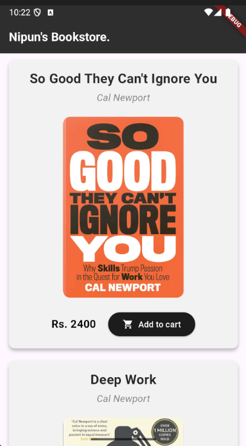
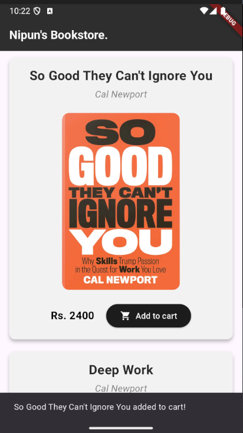

# 📚 Nipun's Bookstore App

A sleek and modern Flutter application for browsing and purchasing books. This minimalist bookstore app showcases a curated collection of books with a clean, user-friendly interface.

## ✨ Features

- **Clean Material Design**: Utilizes Material Design 3 with a custom color scheme
- **Responsive Layout**: Adapts to different screen sizes with a scrollable book list
- **Interactive Elements**: Shopping cart functionality with visual feedback
- **Custom Styling**: Consistent typography and design elements throughout the app
- **Bilingual Support**: Supports both English and Sinhala text display

## 📱 Screenshots

<div align="center">
  <p align="center"><strong>App</strong></p>
  
  <p align="center"><strong>ScreenShot 1</strong></p>
  
  <p align="center"><strong>ScreenShot 2</strong></p>
  
</div>

## 🛠️ Technical Details

### Dependencies
- Flutter (latest stable version)
- Material Design 3
- Asset images for book covers

### Project Structure
```
lib/
├── main.dart         # Application entry point
├── book_list.dart    # Main screen with book listing
├── book.dart         # Book widget component
└── constants.dart    # Style constants and theme data
```

### Key Components

#### Book Widget
The `Book` widget is a reusable component that displays:
- Book cover image
- Title and author information
- Price in Sri Lankan Rupees (Rs.)
- Add to cart button with interactive feedback

#### Styling
The app uses a consistent design system defined in `constants.dart`:
- Typography styles for titles, authors, and prices
- Custom button styling with rounded corners
- Dark-themed app bar for contrast
- Card-based layout with subtle elevation

## 🚀 Getting Started

1. **Prerequisites**
   - Flutter SDK installed
   - An IDE (VS Code, Android Studio, or IntelliJ)
   - Git

2. **Installation**
   ```bash
   # Clone the repository
   git clone https://github.com/kavishannip/flutter_bookstore.git

   # Navigate to project directory
   cd bookstore

   # Get dependencies
   flutter pub get
   ```

3. **Running the App**
   ```bash
   flutter run
   ```

## 📂 Asset Requirements

Place your book cover images in the following directory:
```
assets/
├── so_good.jpg
├── deep_work.jpg
└── koombiyo.jpg
```

Make sure to update `pubspec.yaml` with the appropriate asset declarations:
```yaml
flutter:
  assets:
    - assets/
```

## 🎨 Customization

### Adding New Books
To add a new book, update the `BookList` widget in `book_list.dart`:
```dart
Book(
  coverImagePath: 'assets/your_book.jpg',
  title: 'Your Book Title',
  author: 'Author Name',
  price: 2000,
),
```

### Modifying Styles
All style constants can be modified in `constants.dart` to match your brand:
- `kBookTitleStyle`: Book title typography
- `kAuthorStyle`: Author name typography
- `kPriceStyle`: Price display style
- `kButtonStyle`: Add to cart button appearance
- `kAppbarTitle`: App bar title style


## ✍️ Author

Nipun
22UG1-0704

